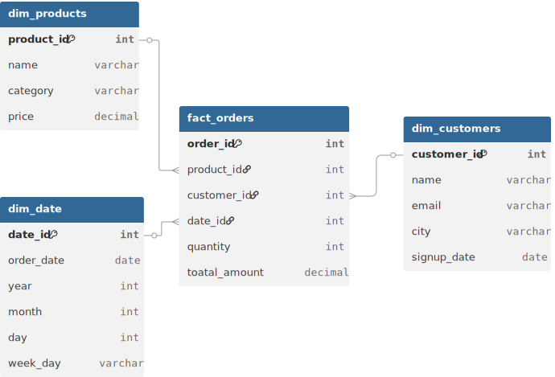

# 🧠 Mini Data Warehouse using CSVs, Python, and DuckDB

This project builds a **mini data warehouse** using raw CSV files, Python for ETL, and DuckDB for SQL analytics — without using a traditional database.

---

## 📂 Raw Data Description

All raw files are placed inside `raw_data/` and contain intentional **data quality issues** like:

| File                | Anomalies Included                                        |
|---------------------|-----------------------------------------------------------|
| `customers_raw.csv` | ✅ Nulls in email/name, duplicate IDs and rows           |
| `products_raw.csv`  | ✅ Inconsistent casing (`"   electronics "`), null prices |
| `orders_raw.csv`    | ✅ Null quantity/order_date, duplicate order IDs          |

These messy CSVs simulate real-world raw data that must be cleaned and modeled.

---

## ⚙️ ETL Process with Python (`etl_pipeline.py`)

The file `etl_pipeline.py` handles the complete pipeline:

### 🧼 Features:
- Removes **duplicate** and **null** rows
- Cleans text:
  - Lowercases `category`
  - Strips and lowercases `email`
- Standardizes `order_date` to `YYYY-MM-DD`
- Creates a **date dimension** from order dates
- Calculates `total_amount = quantity * price`
- Outputs 4 cleaned CSV tables forming a **star schema**

### ▶️ To Run:

```bash
python etl_pipeline.py
```

---

## ⭐ Star Schema Design

The warehouse follows a classic **Star Schema**:

### 🔸 Central Fact Table

- **`fact_orders`**: contains `order_id`, `product_id`, `customer_id`, `date_id`, `quantity`, `total_amount`

### 🔹 Dimension Tables

- **`dim_customers`**: information on customers  
- **`dim_products`**: cleaned product information  
- **`dim_date`**: derived from `order_date` with columns like `year`, `month`, `day`, `weekday`

### 📊 Star Schema Diagram



*Visual representation of the data warehouse star schema with fact and dimension tables*

---

## 🧠 SQL Analytics with DuckDB

All SQL queries are modularized into individual `.sql` files inside the `sql/` folder for better organization and maintainability.

### 🔍 Current SQL Query Files

| Query File                           | Description                              |
|--------------------------------------|------------------------------------------|
| `Top_5_spends_by_customers.sql`      | Top 5 customers by total spend          |
| `Monthly_revenue_trend.sql`          | Revenue trend per month/year            |
| `Best_selling_product_categorie.sql`| Best-selling product category        |
| `Top_cities_by_revenue.sql`          | City-wise revenue breakdown             |

---

## 📄 SQL Query Execution: `duckdb_analysis.py`

This script is responsible for executing the SQL queries using [DuckDB](https://duckdb.org/), an in-process SQL OLAP database.

### 🛠 What it does:
- Loads the **transformed warehouse CSVs** into **in-memory DuckDB tables**
- **Dynamically reads all `.sql` files** from the `sql/` directory
- Executes each query automatically and displays formatted results
- Handles errors gracefully for individual queries

### 🔧 Key Features:
- **Modular SQL queries**: Each analysis is in its own SQL file
- **Dynamic execution**: Automatically finds and runs all SQL files
- **Error handling**: Continues execution even if one query fails
- **Formatted output**: Clean display with query names and results

### ▶️ To Run:

Make sure you have `duckdb` installed:

```bash
pip install duckdb
```

Then execute the analysis:

```bash
python duckdb_analysis.py
```

---

## 🏗️ Project Structure

```
ETL Assignment/
├── 📁 raw_data/
│   ├── 📄 customers_raw.csv
│   ├── 📄 products_raw.csv
│   └── 📄 orders_raw.csv
├── 📁 transformed_data/
│   ├── 📄 dim_customers.csv
│   ├── 📄 dim_products.csv
│   ├── 📄 dim_date.csv
│   └── 📄 fact_orders.csv
├── 📁 sql/
│   ├── 📄 Top_5_spends_by_customers.sql
│   ├── 📄 Monthly_revenue_trend.sql
│   ├── 📄 Best_selling_product_category.sql
│   └── 📄 Top_cities_by_revenue.sql
├── 🐍 etl_pipeline.py
├── 🦆 duckdb_analysis.py
├── 🖼️ star_schema.svg
└── 📋 README.md
```

---

## 📊 Sample Analysis Results

### 🏆 Top 5 Customers by Spend
```
              name  total_spend
0      Joshua Ryan      1529.95
1  Nicholas Murphy      1208.97
2    Steven Foster       951.39
3    Melissa Price       859.97
4    Andrew George       699.98
```

### 📈 Best Selling Product Category
```
      category  total_sold
0  electronics        32.0

```

### 🏙️ Top Cities by Revenue
```
              city  city_revenue
0    South Charles       1529.95
1    Lake Kimberly       1208.97
2      East Rachel        951.39
3      Port Joseph        859.97
4    South William        699.98
```

### 📊 Monthly Revenue Trend
```
    year  month  monthly_revenue
0   2023     11           873.87
1   2023     12          1678.42
2   2024      4          1399.96
3   2024      7          1163.90
4   2024      6           753.37
```

---

## 🚀 Getting Started

1. **Clone the repository**
2. **Install dependencies:**
   ```bash
   pip install pandas duckdb
   ```
3. **Run the ETL pipeline:**
   ```bash
   python etl_pipeline.py
   ```
4. **Execute analytics:**
   ```bash
   python duckdb_analysis.py
   ```

---

## 🛠️ Technologies Used

- **Python** - ETL processing and data transformation
- **Pandas** - Data manipulation and cleaning
- **DuckDB** - In-memory SQL analytics engine
- **CSV** - Data storage format

---

*Built as part of the MITZ Internship ETL Assignment*